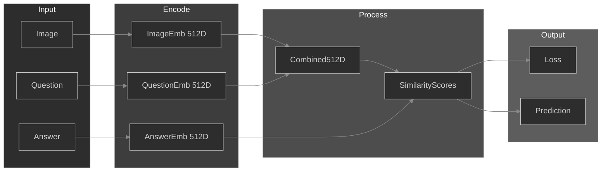

# SynerVQA

A Visual Question Answering (VQA) system using joint embedding learning to align visual and textual representations in a shared semantic space.

## Architecture




## Key Features

- **Joint Embedding Space**: Maps images, questions, and answers into a shared 512D semantic space
- **Contrastive Learning**: Uses similarity-based loss to learn discriminative representations
- **Lightweight Architecture**: CNN-based image encoder + BiLSTM text encoder
- **Easy-VQA Dataset**: Trained on simple geometric shapes and color-based questions

## Project Structure

```
SynerVQA/
├── preliminaries/joint-emb/    # Main VQA model implementation
│   ├── model.py                # Neural network architectures
│   ├── train.py                # Training script
│   ├── predict.py              # Inference script
│   └── best_vqa_model.pth      # Trained model weights
├── dataset.py                  # Dataset download utility (bulk)
├── download-tdata.py           # Dataset download utility (specific images)
└── easy_vqa_data/              # Downloaded dataset directory
```

## Quick Start

### 1. Download Dataset
```bash
# Download 200 training images
python dataset.py

# Or download specific image IDs
python download-tdata.py
```

### 2. Train Model
```bash
cd preliminaries/joint-emb
python train.py
```

### 3. Run Inference
```bash
python predict.py
```

## Model Components

### Image Encoder
- 3-layer CNN (32→64→128 channels)
- MaxPooling + Dropout (0.4)
- Output: 512D embedding

### Text Encoder
- Word embeddings (300D)
- Bidirectional LSTM (256 hidden units)
- Output: 512D embedding

### Answer Embedding
- Learnable embedding matrix
- Maps each answer to 512D space

### Training
- **Loss**: Contrastive cross-entropy with temperature scaling (τ=0.07)
- **Similarity**: Cosine similarity between combined (image+question) and answer embeddings
- **Prediction**: argmax over similarity scores

## Dataset

Uses [easy-VQA](https://github.com/vzhou842/easy-VQA) dataset:
- 64×64 PNG images
- Simple geometric shapes
- Questions about colors, shapes, and positions
- Binary and categorical answers

## License

MIT License - See [LICENSE](LICENSE) file for details
